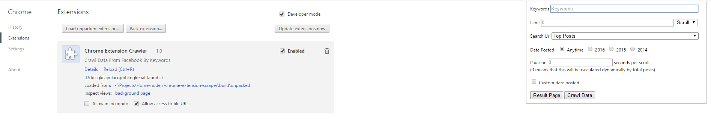
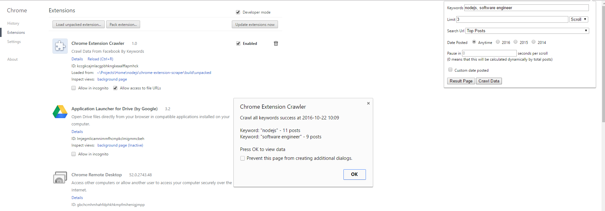

# Chrome Extension Crawler

This is a Chrome extension used for crawling posts from many social sites (**currently only supported Facebook.com**)

**NOTE**: this project is currently on highly development, its usage, architecture and code may change anytime in the future. PRs are welcomed :).

#### Production Mode

```
$ npm run build
```

#### Development Mode

```
$ npm run dev
```

Now you can install the `build/unpacked` folder to Chrome to use :)

After installed, you will see a UI like this



#### Usage

`Keywords`: keywords used to search, multiple keywords split by comma, eg. `nodejs, software engineer`...etc

`Limit`: supported following types:
  + `scroll`: limit by total scrolls
  + `post`: limit by total posts
  + `day`: limit by post's created time, eg. `1` will crawl posts that created yesterday, `2` will crawl posts that created the day before yesterday, and so on.
  + `month`: same as day

`Search Url`: url will be used to search

`Date posted`: select posts created time. You can also use custom date posted by clicking to the `Custom date posted` checkbox. **NOTE**: cannot use this and limit by `day`, `month` simultaneously.

`Pause in`: Sleeping time each scroll

After choose above options, now you can click to the `Crawl data` button to start the crawler. You can also click to the `Result page` button to view and export all crawled posts.
**NOTE**: After crawling success, you will see a popup display all crawling information, like how many crawled posts, how many crawled posts per keyword.



Now you can click OK to go to the result page. You can also export all crawled posts to CSV as well.

#### License

MIT
